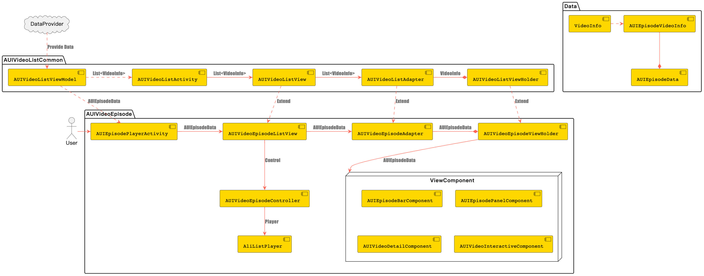
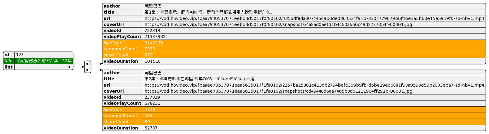

# **AUIVideoEpisode**

## **1. Module Introduction**

**AUIVideoEpisode**module is designed for short drama scenarios. It provides a drawer-style episode list and is responsible for playing and displaying specified short drama episodes, delivering an immersive playback experience.

## **2. Prerequisites**

You have obtained the player license authorization and License Key for the Audio-Video Terminal SDK. For information on obtaining the license, please refer to [申请License](https://help.aliyun.com/zh/apsara-video-sdk/user-guide/license-authorization-and-management#13133fa053843)。

## **3. Compilation and Execution**

1. Integrate the authorized Audio-Video Terminal SDK license.

   For detailed instructions, please refer to [Bind a license](https://www.alibabacloud.com/help/en/apsara-video-sdk/user-guide/access-to-license)。
   
2. Copy the AUIVideoEpisode and AUIVideoListCommon modules from the AUIVideoList directory into your project.

   Make sure to modify the compile version and the player SDK version in the build.gradle files of these modules to match your project settings.

   The player SDK version can be configured in AUIVideoListCommon/build.gradle (refer to the externalPlayerFull in AndroidThirdParty/config.gradle).

3. In the repositories configuration of your project's gradle file, add the Maven source for the Alibaba Cloud SDK:

   ```groovy
   maven { url "https://maven.aliyun.com/repository/releases" }
   ```
   
4. Add the module reference and dependency.

   In your project's setting.gradle, add:
   ```groovy
   // The project root directory contains an AUIVideoList folder with the AUIVideoListCommon and AUIVideoEpisode modules. 
   include ':AUIVideoList:AUIVideoListCommon'
   include ':AUIVideoList:AUIVideoEpisode' 
   // If these modules are directly placed under the root directory, include them as ':AUIVideoListCommon' and ':AUIVideoEpisode'
   ```

   In the build.gradle of your app module, add:
   ```groovy
   implementation project(':AUIVideoList:AUIVideoEpisode')
   // Similarly, if this module is placed under the root directory, just write ':AUIVideoEpisode'
   ```

5. Configure page navigation to open the main interface of the corresponding module from the current page.

   ```java
   Intent videoListEpisodeIntent = new Intent(this, AUIEpisodePlayerActivity.class);
   startActivity(videoListEpisodeIntent);
   ```

Note: Please confirm your video source address, if the video source address is the MP4 private encryption address provided by the module, due to the encryption characteristics, the integration into your project will be invalid. Please change the variable value of EPISODE_JSON_URL in the AUIEpisodeConstants file to manually switch the episode address.

### **Integration FAQ**

1. Error “Namespace not specified”

   Please check your AGP version. If it's a newer version (like 8.3.2), you need to manually add the namespace setting in each module's build.gradle file. For older AGP versions, this configuration is located in the package attribute of the module's /src/main/res/AndroidManifest.xml.

2. Gradle conflict during repository priority processing

   Please add the repository in setting.gradle as a priority.
                                                           
## **4. Module Description**

### **File Description**

```html
.
└── videoepisode                                            # Root directory of short drama
    ├── AUIEpisodePlayerActivity.java                      # Short drama page
    ├── AUIVideoEpisodeController.java                      # Short drama page controller
    ├── adapter                                             # Adapter directory
    │   ├── AUIEpisodePanelAdapter.java                     # Short drama panel adapter
    │   └── AUIVideoEpisodeAdapter.java                      # Short drama video page adapter
    ├── annotation                                          # Enumeration directory
    │   └── PreRenderPlayerState.java                        # Prerender state enumeration
    ├── component                                           # Page component directory
    │   ├── AUIEpisodeBarComponent.java                     # Short drama page bottom bar component
    │   ├── AUIEpisodePanelComponent.java                    # Episode list component
    │   ├── AUIVideoDetailComponent.java                     # Feed flow page detail component (username, video details)
    │   └── AUIVideoInteractiveComponent.java                # Feed flow page interactive component (like, comment, share)
    ├── data                                                # Data structure directory
    │   ├── AUIEpisodeConstants.java                        # Short drama constants
    │   ├── AUIEpisodeData.java                              # Episode data structure
    │   ├── AUIEpisodeDataEvent.java                         # Episode update event
    │   └── AUIEpisodeVideoInfo.java                         # Single episode video data
    ├── listener                                            # Callback and listener directory
    │   ├── OnDetailEventListener.java                      # Feed flow page detail component callback event
    │   ├── OnInteractiveEventListener.java                 # Feed flow page interactive component callback event
    │   ├── OnPanelEventListener.java                       # Episode list component callback event
    │   └── OnSurfaceListener.java                          # Short drama video page Surface state callback event
    └── view                                                # View directory
        ├── AUIVideoEpisodeLayoutManager.java               # Short drama feed flow vertical scroll page layout controller
        └── AUIVideoEpisodeListView.java                     # Short drama feed flow vertical scroll page layout

```

### **Architecture Design**



### **Entry Page**

* **AUIEpisodePlayerActivity**

**External Integration**：If you need to use the short drama page as an atomic page for external navigation, simply remove the DataProvider from AUIEpisodePlayerActivity; instead, pass the AUIEpisodeData data to the current page during navigation.

### **Data Definition**

* **Episodes**

AUIEpisodeData

| Field  | Description                               |
|--------|-------------------------------------------|
| id     | Unique ID of the short drama episode      |
| title  | Name of the short drama episode           |
| list   | List of videos in the short drama episode |

* **Single Episode Video**

AUIEpisodeVideoInfo



Inherited from the base class VideoInfo, new fields marked in orange include the number of likes, comments, and shares.

### **Data Source**

The current Demo uses mock data obtained from a web JSON file, referenced by the constant `EPISODE_JSON_URL`。

Data retrieval logic: AUIVideoListViewModel.DataProvider<AUIEpisodeData> dataProvider, which requests data via onLoadData.

## **5. Core Capabilities Introduction**

This component leverages the Alibaba Cloud Player SDK's AliListPlayer to implement its functionality, utilizing core features such as local caching, intelligent preloading, intelligent prerendering, HTTPDNS, and encrypted playback to significantly enhance viewing experience in terms of playback delay, stability, and security. For more details, refer to [进阶功能](https://help.aliyun.com/zh/vod/developer-reference/advanced-features)。

### **Local Caching**

Local caching improves short video playback loading speed and stability, allowing users to watch videos smoothly even in unstable network conditions, thereby enhancing user watching experience.

### **Intelligent Preloading**

Intelligent preloading loads video data in advance, making video playback smoother, reducing loading wait times, and enhancing user watching experience.

### **Intelligent Prerendering**

Intelligent prerendering reduces video playback start delay, allowing users to see the video more quickly, and enhancing video playback loading speed and viewing experience.

### **HTTPDNS**

HTTPDNS can provide faster and more stable DNS resolution services. By replacing traditional DNS resolution, it can reduce DNS resolution time, improve video playback loading speed and stability, thus enhancing user viewing experience.

From version 6.12.0, HTTPDNS is automatically enabled in both the Audio-Video Terminal SDK and the Player SDK.

### **Video Encryption**

From version 6.8.0, both the Audio-Video Terminal SDK and the Player SDK support private encryption playback for MP4 videos.

- MP4 videos with private encryption must meet the following conditions to be played normally:
    - The business side (App side) must append `etavirp_nuyila=1` to the video URL when passing it to the player.
    - The uid of the App's License must be consistent with the uid that generated the private encrypted MP4.
- To verify whether the encrypted video is correct, check the privately encrypted video URL:
    - Meta information contains the `AliyunPrivateKeyUri` tag.
    - Cannot be played directly by ffplay.

### **Other Features**

- **Screen Recording Prevention**

  Screen recording prevention blocks the playback process by monitoring screen recording and screenshot behaviors, effectively protecting video content rights from unauthorized recording and distribution.


## 6. User Guide

### **Documentation**

[ApsaraVideo Player SDK](https://www.alibabacloud.com/help/en/vod/developer-reference/apsaravideo-player-sdk/)

[ApsaraVideo MediaBox SDK](https://www.alibabacloud.com/en/product/mediabox_sdk)

[ApsaraVideo VOD](https://www.alibabacloud.com/en/product/apsaravideo-for-vod/)

[视频点播控制台](https://vod.console.aliyun.com)

[ApsaraVideo VOD](https://www.alibabacloud.com/zh/product/apsaravideo-for-vod)


### **FAQ**

[Troubleshoot playback errors](https://www.alibabacloud.com/help/en/apsara-video-sdk/developer-reference/troubleshoot-playback-errors)
